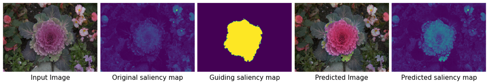
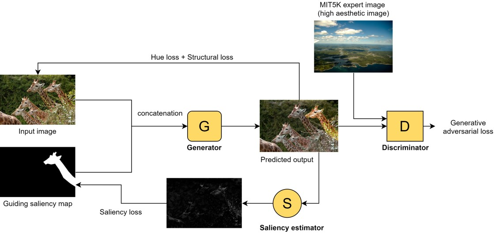

## Aesthetic Driven Saliency Retargeting and Color Enhancement Network

Saliency retargeting refers to technique to alter focus in an image to guide a viewer’s attention. We are here to propose a saliency retargeting (attention retargeting) approach using deep learning that will take in an image together with a guiding saliency map and manipulate the input image according to the guiding saliency map. We will be employing a saliency estimator in guiding where the salient region should be, and several loss functions are used to train the model towards the result that we desired. GAN (Generative adversarial network) is utilized to make the output image looks realistic and to enhance the image aesthetic quality by using the idea of unpaired image enhancement.



## Overview

### This repo contains the following files
| Files                                     | Description | 
| :-----                                    | :-----                                             | 
| color_convert&#46;py                      | Contains operations for changing colorspaces       | 
| custom_layers&#46;py                      | Contains custom-written layers and operations      |  
| helper&#46;py                             | Contains functions to build feature extractors     | 
| models&#46;py                             | Contains models for the network                    | 
| networks&#46;py                           | Contains the overall network architecture          | 
| train&#46;py                              | Script to start or resume training                 | 
| utils&#46;py                              | Contains image loading and augmentation operations | 
| weights_mobilenet_aesthetic_0.07&#46;hdf5 | Weights for MobileNet NIMA model (aesthetics)      | 
#
### Get the dataset
Get the dataset from the link below, and extract the contents in the root directory of this project:
```sh
https://1drv.ms/u/s!AtlNg2fPKuzNjLAoMhzPZaVWYxPs9Q?e=i81Rfj
```
#
### Install the required packages and libraries
To install all packages from requirements&#46;txt:
```sh
$ pip install -r requirements.txt
```
#
### Instructions for training the network
To start or resume the training process:
```sh
$ python train.py
```
To start or resume the training process with supported flags:
```sh
$ python train.py --epochs=1000 --batch_size=2
```
| Supported Flags | Description | Default Value |
| :-----          | :-----                                        | :------: |
| --epochs        | number of total epoches                       | 1000     |  
| --batch_size    | number of samples in one batch                | 2        |    
| --patch_size    | image resolution during training              | None     |  
| --lr_gen        | initial learning rate for generator           | 1e-4     | 
| --lr_disc       | initial learning rate for discriminator       | 1e-4     | 
| --eval_rate     | rate for evaluating and saving checkpoints    | 100      |  
#
### Visualizing training process with Tensorboard
Type the command below in another terminal once you've started the training process:
```sh
$ tensorboard --logdir=logs
```
#
### Notes
- It is highly recommended to setup and run the project in a virtual environment (either conda or virtualenv)
- This is tested primarily on python 3.6.x
- You may need a microsoft account to download the dataset 
- Running train&#46;py will create a "checkpoints" folder (for tensorflow to save or load models) and a "logs" folder (for tensorboard to store training progress) in the root directory
#
### To-Do
- Testing script/notebook

